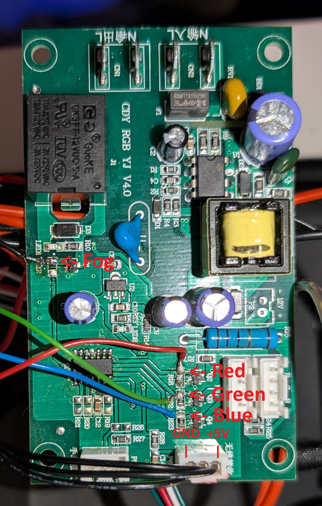
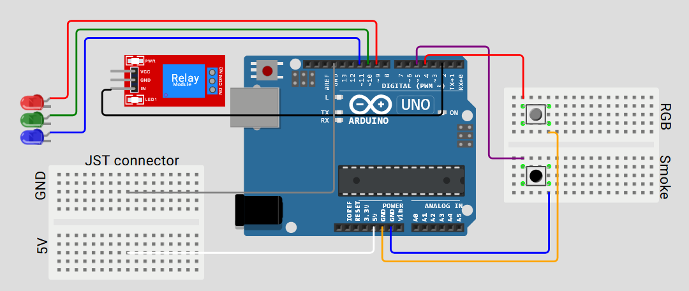
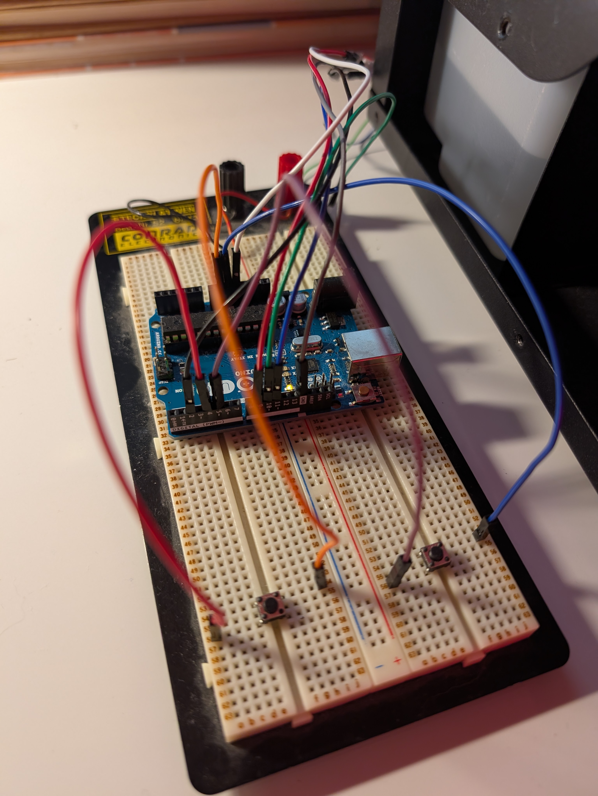
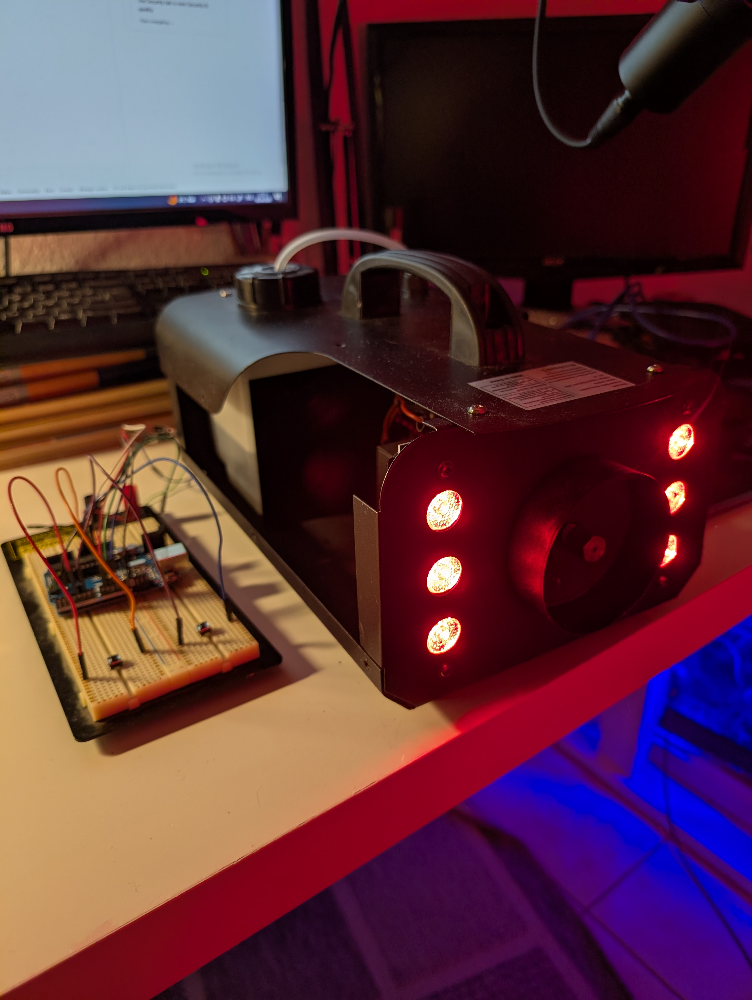

# Fog Machine Controller

This is an Arduino based controller for the UKING ZQ10016 FOG MACHINE built as a replacement for a lost remote. We could not find a replacement remote online so we decided to use an Arduino to bypass the need for one. This allows us to control the fog machine and its lights directly.

## Wiring

First disassemble the fog machine to access its control board. The board needs to be removed since cables have to be soldered onto it to bypass its microcontroller. The original microcontroller received signals from the remote via a wireless receiver and controls the machine accordingly and we need to bypass that. We unplug the JST connector from the receiver and use it as a power supply for the Arduino board.

This works because we are essentially doing the same job as the remote and microcontroller would but we are just sending signals directly. The large black component on the top left of the board is a relay. By sending a signal into its IN port we allow current from the mains supply to flow into the pump which then produces the fog. The heating element runs continuously whenever the machines power switch is on. For the lights we send PWM signals (values 0–255) from the Arduino directly to the board which uses its onboard transistors to drive the RGB LED strip.

Above is an image showing the soldering. The cables are soldered onto the pads connected to the NPN transistors. The image marks the connections for the fog relay, RGB lights, and JST GND/+5V. Here is the wiring used:

RGB Button   -> Pin 4  (other to GND)
Smoke Button -> Pin 5  (other to GND)

JST +5V      -> Arduino 5V
JST GND      -> GND

Relay IN     -> Pin 2 

Red cable    -> Pin 9  
Green cable  -> Pin 10 
Blue cable   -> Pin 11 

The code was written and uploaded onto the Arduino UNO board using the Arduino IDE. It would also work using other boards however you would need to change its Pin settings. The Arduino is powered through the JST connector which uses the fog machine boards internal 5V supply so no separate power source is needed for the Arduino after uploading the code. The Arduino purely acts as a controller sending signals to the relay and RGB inputs on the board.

## Images

